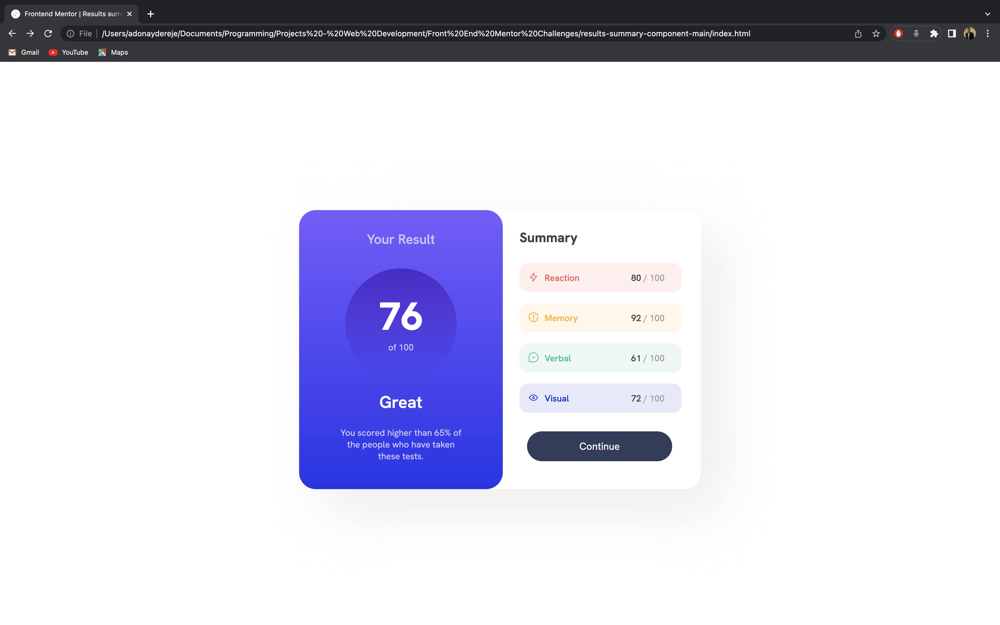

# Frontend Mentor - Results summary component solution

This is a solution to the [Results summary component challenge on Frontend Mentor](https://www.frontendmentor.io/challenges/results-summary-component-CE_K6s0maV). Frontend Mentor challenges help you improve your coding skills by building realistic projects. 

## Table of contents

- [Overview](#overview)
  - [The challenge](#the-challenge)
  - [Screenshot](#screenshot)
  - [Links](#links)
- [My process](#my-process)
  - [Built with](#built-with)
  - [What I learned](#what-i-learned)
  - [Useful resources](#useful-resources)
- [Author](#author)

## Overview

### The challenge

Users should be able to:

- View the optimal layout for the interface depending on their device's screen size
- See hover and focus states for all interactive elements on the page

### Screenshot

### Links

- Solution URL: [Add solution URL here](https://your-solution-url.com)
- Live Site URL: [Add live site URL here](https://your-live-site-url.com)

## My process

### Built with

- Semantic HTML5 markup
- CSS custom properties

### What I learned

I would say I have learned how to Implement HTML and CSS to design a certain block in a webpage. It has helped me to adapt myself
with spacings (margins, paddings and the like)

### Useful resources

- https://css3buttongenerator.com/ - This helped me for creating my button.

## Author
- LinkedIn - [@AdonayDereje](https://www.linkedin.com/in/adonay-dereje-78355816b/)
- Frontend Mentor - [@yourusername](https://www.frontendmentor.io/profile/AdonayDereje)